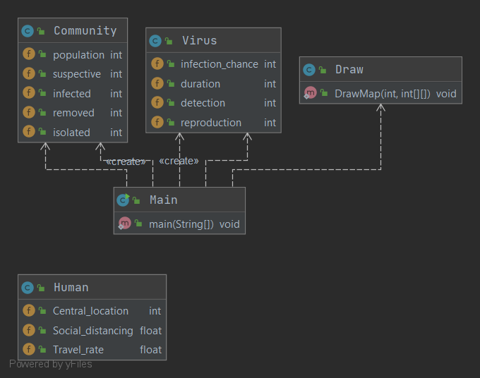
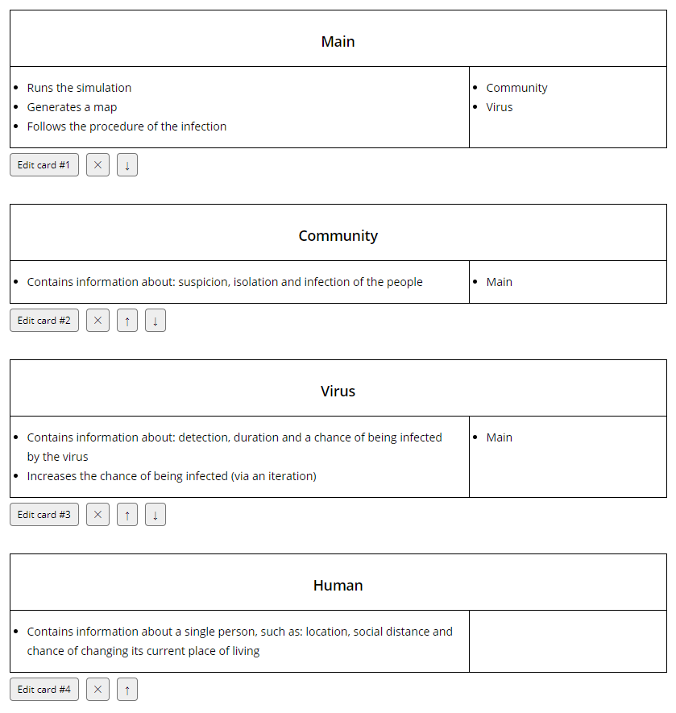
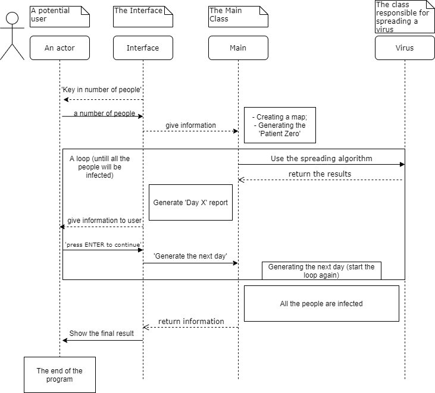

	<h2>
		Programowanie obiektowe  
		INEW0003P  
		Projekt
	</h2>

|      Wydział elektroniki       |  Kierunek: informatyka  |
|:-------------------------------|------------------------:|
| Grupa zajęciowa: Cz 17:05      | Semestr: 2019/2020 Lato |
| Nazwisko i Imię: Byczko Maciej | Nr indeksu: 252747      |
| Nazwisko i Imię: Maziec Michał | Nr indeksu: 252718      |
| Prowadzący:                    | mgr inż. Bogdan Gulowaty|

## Temat: Symulacja interakcji pomiędzy obiektami

<h4>
Ocena: 
Punkty: 
Data:  
</h4>

## Założenia i opis funkcjonalny programu

#### Założenia

Stworzenie prostej symulacji agentowej z wykorzystaniem technik projektowania obiektowego. 
Program modelujący wybrany wycinek rzeczywistości, a dokładniej obiekty i występujące pomiędzy nimi interakcje. Model ma być wprawiany w ruch wykorzystując generowane losowo zdarzenia, które zmuszają obiekty do rozmaitych działań.

## Analiza czasownikowo - rzeczownikowa

 Naszym zadaniem było zaprojektowanie prostej symulacji agentowej, w której badane jest zachowanie 
 ludzi w czasie rozprzestrzeniania się wirusa. Dla uproszczenia symulacji przyjęliśmy, że ludzie zamieszkują jednowymiarową przestrzeń o podanej wielkości, w której może dojść do zarażenia się wirusem przez styczność osób w sąsiedztwie.

**Zachowania ludzi:**
- Ludzie będą mogli zmieniać swoje położenie oraz będą dążyli do izolacji, by zmniejszyć szansę na zarażenie się wirusem i chronić inne osoby przed rozprzestrzenieniem się zarazy. 

**Parametry symulacji:**
- Zadana wielkość mapy
- Liczba ludzi
- Szansa na zarażenie się
- Czas trwania pandemii (symulacja kończy się w chwili zarażenia lub wyleczenia całego społeczeństwa)
- Wykrycie zarażenia (boolean)
- Zachowanie dystansu przez danego człowieka

## Diagramy
#### Przypadki użycia

#### Klasy

#### Karty CRC

#### a Sequence Diagram

